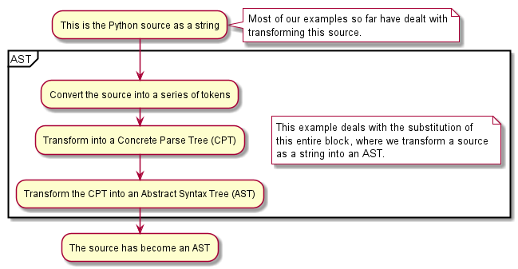

.. admonition:: Summary

    Demonstrates how to use an import hook to do custom parsing
    and create an Abstract Syntax Tree (AST)

   `Source code for polish_expr <https://github.com/aroberge/ideas/blob/master/ideas/examples/polish_expr.py>`_

So far, our examples have consisted of transforming the program source before
Python created an AST, or transforming the AST after its creation by Python.

This example, created by Devin J. Pohly, demonstrates how we can bypass Python to create an AST.

.. caution::

    This example cannot be combined with (most) other types of transformations.
    Furthermore, the interactive console turns into a Polish expression calculator
    and most Python syntax, including the use of ``exit()``, becomes a ``SyntaxError``.

.. automodule:: ideas.examples.polish_expr
