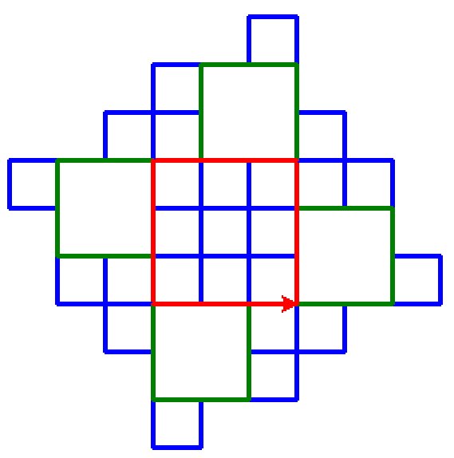

.. admonition:: Summary

   This example re-uses two existing transformations:

   **French Python**, which uses a non-standard file extension ``.pyfr``
   as an indication that an import hook must be used; and **repeat as a keyword**.

   `Source code <https://github.com/aroberge/ideas/blob/master/src/ideas/included/french_repeat.py>`_

French repeat
==============

To produce the above image, you can use the following (files found
in usage_demo directory):

.. literalinclude:: ../../../docs_examples/french_repeat/tortue_demo.py

and

.. literalinclude:: ../../../docs_examples/french_repeat/tortue.pyfr

This is how I executed them:

.. code-block:: none

   (venv-ideas3.11) C:\Users\Andre\github\ideas\usage_demo
   > py tortue_demo.py

