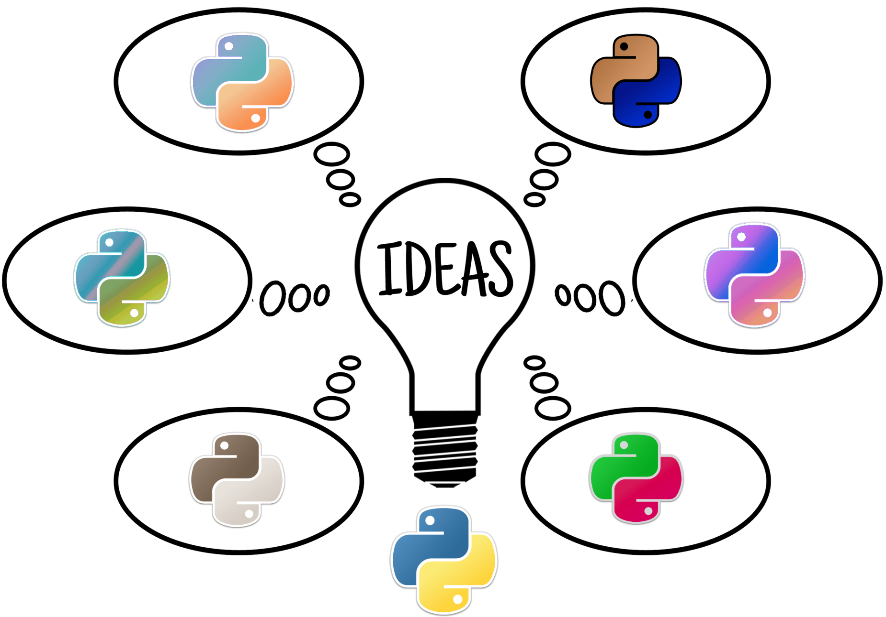

Ideas: making it easier to extend Python's syntax
========================================================

You have an **Excellent** |tm| idea to change the Python syntax and want
to find a way to include your
**Excellent** |tm| idea in your Python programs.
According to `Python Developers Guide <https://devguide.python.org/langchanges/>`_,
this might be doable if you are willing to follow "a few steps" including:

1. Get a copy of the CPython's code repository and all the required compilers
   for your platform.
2. Modify the grammar file to add rules for the new syntax.
3. Modify the AST generation code; this requires a knowledge of C
4. Compile the AST into bytecode
5. Recompile the modified Python interpreter

This ... can be a rather daunting task.

However, there is a simpler way: it is possible to run code with a
modified syntax using import hooks. ``ideas`` is designed to facilitate
the creation of such import hooks, and be a repository for
examples that can be used as starting points for new ideas.

.. warning::

    Doing something like what is described in this documentation
    is not recommended for production code.

    But it can be fun! ;-)

Quick links to topics
---------------------

.. note::

    Most of the links below lead to mostly empty pages.
    Much more content will be added ... " *soon* ".

.. toctree::
   :maxdepth: 1

    Motivation <motivation>
    Usage <usage>
    Special console <repl>
    Importing a module as main <as_main>
    Overview of all possibilities <possible>
    Examples never included <excluded>

.. toctree::
   :maxdepth: 1
   :caption: Examples

    ``function`` as a keyword <function>
    ``nobreak`` as a keyword <nobreak>
    French Python <french>
    ``repeat`` as a keyword <repeat>
    λ encoding <lambda>
    Simple AST transformation <ast>
    Simple bytecode transformation <bytecode>
    Pythonic switch statement <switch>
    True constants <constants>
    Json module <json>
    PEP 505: None-aware operators <pep_505>
    Import from non-standard locations <non_files>

.. toctree::
   :maxdepth: 1
   :caption: API

    import_hook.py <import_hook>
    utils.py <utils>
    console.py <console>

To do
-----

.. todolist::

.. _Pyxl project: https://github.com/dropbox/pyxl

.. |tm| unicode:: U+000AE .. REGISTERED SIGN
