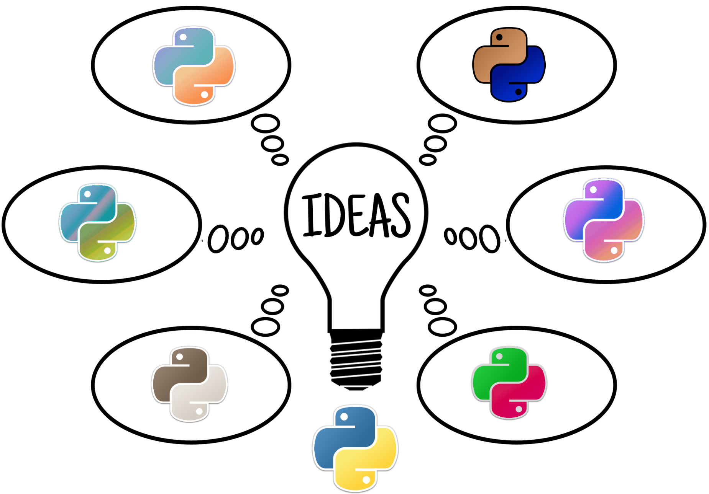

Ideas: making it easier to extend Python's syntax
==================================================

.. warning::

    As of August 18 2026, I've started updating this project after a 4 year hiatus. 
    The version that can be installed via pypi (using pip) has not been updated yet.

`Code on Github <https://github.com/aroberge/ideas>`_

You have an **Excellent Idea** |tm| to change the Python syntax and want
to find a way to include your
**Excellent Idea** |tm|  in your Python programs.
According to `Python Developers Guide <https://devguide.python.org/langchanges/>`_,
this might be doable if you are willing to follow "a few steps" including:

    1. Get a copy of the CPython's code repository and all the required compilers
       for your platform.
    2. Modify the grammar file to add rules for the new syntax.
    3. Modify the AST generation code; this requires a knowledge of C
    4. Compile the AST into bytecode
    5. Recompile the modified Python interpreter

This ... can be a rather daunting task. It might get a bit easier if
you grab a copy of the currently unpublished book by Anthony Shaw,
*CPython Internals* and read it from cover to cover,
but it will still remain a major task. Furthermore, it would not be easy
to share your work with others so that they can try it out.

However, **there is a simpler way:** it is possible to run code with a
modified syntax using import hooks [*or, in some cases as shown later,
using a custom codec*.]

Quick links to topics
---------------------

.. toctree::
   :maxdepth: 2
    
    What is ideas? <what>
    Additional motivation <motivation>
    Usage  <usage>
    Create your own import hook <function_keyword>
    Improving function as a keyword <function>
    A deep dive <possible>

.. toctree::
   :caption: Many examples

    Guide to the many examples included <guide>

.. toctree::
   :maxdepth: 2
   :caption: Other modules

    About tokens <tokenize>
    Capture of token_utils interactive demo <tokenize_notebook.ipynb>
    import_hook.py <import_hook>
    console.py <console>

To do
-----

.. todolist::

.. |tm| unicode:: U+000AE .. REGISTERED SIGN
