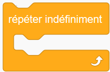

repeat as a keyword
=======================

.. admonition:: Summary

    Adds a ``repeat`` keyword that can be used to indicate 4 different
    versions of a loop.

    **Limitation**: ``repeat`` statements must be on a single line of
    code ending with a colon [and an optional end of line comment].

    `Source code <https://github.com/aroberge/ideas/blob/master/ideas/examples/repeat.py>`_

.. sidebar:: Why this is an important example to me?

    Having a ``repeat`` keyword addition is something that I have wanted
    (and included) for teaching young beginners. It was also my
    `first attempt at writing an import hook <https://aroberge.blogspot.com/2015/10/from-experimental-import-somethingnew.html>`_. Prior to that, I
    had already implemented ``repeat`` using a different method
    in `Reeborg's World <http://reeborg.ca>`_

    I was not the only one: Tobias Kohn, who
    created `TygerJython <http://jython.tobiaskohn.ch/>`_
    as part of his Ph.D. thesis, also found it useful to add such a keyword
    to Python.

From blocks to textual code
---------------------------

Repeating a series of instructions is something that is often done when
running programs.  Block-based programming environments, such as
`Scratch <https://scratch.mit.edu/>`_,
`Blockly <https://developers.google.com/blockly/>`_,
`GP <https://gpblocks.org/>`_, etc,
have different blocks that can be used for this purpose.  For example:

.. image:: _static/repeat10.png
   :scale: 100 %
   :alt: Repeat 10 block

.. image:: _static/repeat_until.png
   :scale: 100 %
   :alt: Repeat until block

and a "repeat forever" loop (shown in French below):

Depending on the block-based environment one uses, there are up to four
four main such cases, which can be written as follows
in standard Python::

    for _ in range(n):
        '''Repeat a series of instruction n times, without having to
           keep track of the specific iteration number
        '''

    while condition:
        '''Repeat a series of instruction an unspecified number of times,
           while a certain condition is met.
        '''

    while not condition:
        '''Repeat a series of instruction an unspecified number of times,
           until a certain condition is met.
        '''

    while True:
        '''Repeat a series of instruction an unspecified number of times,
           until a something inside the loop triggers a "break" to end the loop.
        '''

Inspired by the choices made by creators of block-based programming environments,
in my `AvantPy project <https://aroberge.github.io/avantpy/docs/html/>`_,
I included a few additional keywords to cover the 4 cases above
in a natural way::

    repeat n:
        # code

    repeat while condition:
        # code

    repeat until condition:
        # code

    repeat forever:
        # code

.. sidebar:: Learning from other experts

   The Quorum computing language has been designed based on evidence gathered
   from `how human learn programming languages <https://quorumlanguage.com/evidence.html>`_.

   It includes `three of the four repeat <https://quorumlanguage.com/tutorials/language/repeat.html>`_ choices mentioned above, with a slightly different syntax::

        repeat 10 times
            // code
        end

        repeat while condition
            // code
        end

        repeat until condition
            // code
        end

A concrete example
-------------------

.. admonition:: First, TygerJython's explanation

    **Why did you add a «repeat»-statement to the language?**

    One of the most difficult aspects for programming novices are
    variables and loops, especially when combined.
    With the ``repeat``-statement we provide the means to create a looping
    construct without the need for variables.
    This way, you can introduce one concept after the other and make it easier for the students to understand them.
    So far, our experience with «repeat» has been very encouraging.

**Suppose that I am teaching programming to beginners using Python's turtle module.**
So far, we've only written programs that use one instruction per line::

    from turtle import forward, left

    # Draw a square

    forward(100)
    left(90)

    forward(100)
    left(90)

    forward(100)
    left(90)

    forward(100)
    left(90)

I wish to use this to show to students how we can have computers **repeat**
a given set of instructions, instead of typing them multiple times.
Using Python, here's the natural way to do this::

    from turtle import forward, left

    # Draw a square

    for variable in range(4):
        forward(100)
        left(90)

In doing so, I need to introduce all at once many new concepts and additional terms:

   1. the concept of an indented code block preceded by a colon;

   2. two keywords, ``for`` and ``in``;

   3. the use of a *variable*, which is some quantity with a completely irrelevant name in this example, except that it cannot be a keyword;

   4. the introduction of a built-in function, ``range()``, which, unlike ``forward()`` or ``left()``, does not have a visual representation.

By contrast, using the ``repeat`` keyword, the above can be written as::

    from turtle import forward, left

    # Draw a square

    repeat 4:
        forward(100)
        left(90)

and we only need to introduce fewer new topics:

   1. the concept of an indented code block preceded by a colon;

   2. one new keyword: ``repeat``.

A final word about the motivation
----------------------------------

We've already mentioned the usage in blocks-based programming environment
of ``repeat``, or some similar alternative in other languages. ``repeat``
was also the clearer possibility for people unfamiliar with programming jargon
as found by Andreas Stefik and Susanna Siebert, and published
"An Empirical Investigation into Programming Language Syntax."
ACM Transactions on Computing Education, 13(4), Nov. 2013.

Implementing repeat
--------------------

From the following API generated by Sphinx, you can get access to the
actual code which, by now, should be fairly straightforward to understand.

.. automodule:: ideas.examples.repeat
   :members:
